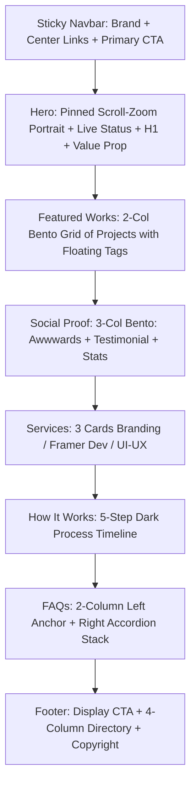

# DESIGN.md: Luzia Portfolio Template

## Source
- URL: https://luzia.framer.website/
- Capture date: 2026-09-14
- Evidence: Live DOM inspection, computed style extraction, Framer CSS variables, Lenis smooth scroll analysis, full-page visual screenshots via Puppeteer & headless Chrome.

## Reference Screenshot


Use this screenshot as the visual source of truth for layout, hierarchy, density, and feel. Tokens below describe the same page in machine-readable form.

---

## Design Summary

**Luzia** is a high-end, contemporary creative portfolio template designed in Framer by Rosyid Qoim (Irise Studio). Its aesthetic blends **clean minimalist Swiss/editorial typography** with **dynamic scroll-driven storytelling** and **softened neo-brutalist / modern bento card geometry**.

### Core Visual Pillars:
1. **Bold Editorial Hero with Scroll-Driven Cinematic Zoom:** Rather than a static hero banner, the hero is an immersive 7,500px+ scroll-pinned viewport where a high-resolution close-up portrait of the designer smoothly scales, moves, and transitions into a frosted glass gradient blur (`backdrop-filter: blur(20px)`), revealing value propositions and status indicators.
2. **High-Contrast Monochromatic Base with Vibrant Semantic Accents:** Crisp white (`#ffffff`) and soft tinted gray (`#f7f7f7`) backgrounds paired with pitch-dark text and buttons (`#111111`), punctuated by intentional electric accents: electric violet (`#7430f7`) for brand flair, glowing signal green (`#00c047`) for live availability pulse, and warm amber (`#efce03`) for accolades.
3. **Sculpted Bento Geometry & Oversized Curvature:** Generous border radii (`24px`, `40px`, and pill `100px`), ultra-subtle multi-stop ambient drop shadows, and clean hairline borders that frame projects like museum placards.
4. **Fluid Motion & Frictionless Tactility:** Powered by Lenis smooth scrolling (`lenis.css`), spring-based micro-interactions on button hover, expandable interactive accordions, and interactive sticky process cards.

---

## Design Tokens

### Colors

#### Primitive CSS Tokens (Extracted directly from Framer source):
| Token Variable | Hex Code | RGB | Role / Usage | Confidence |
| :--- | :--- | :--- | :--- | :--- |
| `--token-7718b53b...` | `#FFFFFF` | `rgb(255, 255, 255)` | Pure White — Card surfaces, navbar fill, pill badges | Measured |
| `--token-d65c47cc...` | `#F7F7F7` | `rgb(247, 247, 247)` | Canvas / Soft Gray — Page section backgrounds, secondary buttons | Measured |
| `--token-556c256e...` | `#D1D3D6` | `rgb(209, 211, 214)` | Hairline Border / Muted Divider | Measured |
| `--token-923661f6...` | `#6C7179` | `rgb(108, 113, 121)` | Muted Text / Secondary Body / Metadata Labels | Measured |
| `--token-2b90e070...` | `#1F1F1F` | `rgb(31, 31, 31)` | Deep Charcoal — Dark card surfaces, step process background | Measured |
| `--token-404da5a0...` | `#111111` | `rgb(17, 17, 17)` | Primary Text / Primary Action Buttons / Strong Contrast | Measured |
| `--token-0989c3d2...` | `#7430F7` | `rgb(116, 48, 247)` | Electric Violet — Brand accent, prominent service highlight | Measured |
| `--token-20fb4c91...` | `#F5F2FF` | `rgb(245, 242, 255)` | Light Violet Tint — Badge background for featured tags | Measured |
| `--token-59ba25ef...` | `#00C047` | `rgb(0, 192, 71)` | Signal Green — Live status badge ("2 projects left in March") | Measured |
| `--token-f6be6067...` | `#EEFFF3` | `rgb(238, 255, 243)` | Light Green Tint — Status indicator halo / soft badge fill | Measured |
| `--token-f0f50c8d...` | `#EFCE03` | `rgb(239, 206, 3)` | Accent Yellow — Star ratings, award badges | Measured |
| `--token-1c56dc90...` | `#FEFEE8` | `rgb(254, 254, 232)` | Warm Yellow Tint — Light badge background | Measured |

---

### Typography

- **Primary Font Family:** `"Instrument Sans", "Instrument Sans Placeholder", sans-serif`
  - Fallback stack: `-apple-system, BlinkMacSystemFont, "Segoe UI", Roboto, Helvetica, Arial, sans-serif`
- **Font Weights:**
  - Regular: `400`
  - Medium: `500`
- **Font Scale & Text Hierarchy:**
  - **Display / H1 (Hero Headline):** `40px` (`2.5rem`), line-height: `1.15`, letter-spacing: `-0.03em`, weight: `500`
  - **Section Title / H2 (Sections, Services, Works):** `36px` (`2.25rem`), line-height: `1.2`, letter-spacing: `-0.025em`, weight: `500`
  - **Card Heading / H3:** `24px` (`1.5rem`), line-height: `1.3`, letter-spacing: `-0.02em`, weight: `500`
  - **Subheading / Stat Value:** `20px` (`1.25rem`), line-height: `1.35`, weight: `500`
  - **Body Text:** `16px` (`1rem`), line-height: `1.5`, color: `#6C7179`, weight: `400`
  - **Secondary / Nav Links:** `15px` (`0.9375rem`), line-height: `1.4`, weight: `500`
  - **Micro / Tags / Status Pills:** `12px` (`0.75rem`), line-height: `1.2`, letter-spacing: `0.01em`, weight: `500`

---

### Spacing, Grid & Layout

- **Container Max-Widths:**
  - Main Content Container: `1120px` (centered, auto horizontal margins)
  - Wide Section Container: `1343px` (Hero content, Navbar)
  - Full Viewport Width: `100vw` (with padding `0 24px` on mobile, `0 40px` on desktop)
- **Grid Patterns:**
  - **Works Showcase:** 2-column responsive grid (`grid-template-columns: repeat(2, 1fr)` on desktop, 1 column on tablet/mobile), gap: `24px`
  - **Social Proof / Reviews:** 3-column equal-width bento row (`1fr 1fr 1fr`), gap: `24px`
  - **Services Grid:** 3-column cards (`repeat(3, 1fr)`), gap: `24px`
  - **Process / How It Works:** Vertical stacked progress layout / sticky card stack, gap: `20px`
  - **FAQs:** Split 2-column layout (Left: Title + Copy + CTA, Right: Accordion stack), gap: `40px`
- **Border Radii:**
  - Small / Outlined Tags: `12px`
  - Buttons / Controls: `16px`
  - Cards (Services, Steps, Bento): `24px`
  - Large Project Showcase Cards & Testimonial Bento: `40px`
  - Pill Badges & Status Indicators: `100px` (or `9999px`)
- **Shadow System (Layered multi-stop precision shadows):**
  - **Elevated Button Shadow:**
    `rgba(0, 0, 0, 0.05) 0.5px 0.5px 0.7px -0.2px, rgba(0, 0, 0, 0.06) 1.3px 1.3px 1.8px -0.4px, rgba(0, 0, 0, 0.08) 2.8px 2.8px 4px -0.6px, rgba(0, 0, 0, 0.11) 6.3px 6.3px 8.9px -0.8px, rgba(0, 0, 0, 0.2) 16px 16px 22.6px -1px`
  - **Card Hover Elevation:**
    `rgba(0, 0, 0, 0.05) 0.7px 0.7px 1px, rgba(0, 0, 0, 0.08) 7.8px 7.8px 11px, rgba(0, 0, 0, 0.13) 22px 22px 31px, rgba(0, 0, 0, 0.2) 40px 40px 56px`
  - **Floating Frosted Glass Overlay:**
    `backdrop-filter: blur(20px); background: linear-gradient(rgba(255, 255, 255, 0) 50%, rgba(255, 255, 255, 0.5) 100%);`

---

## Components

### 1. Navigation Bar
- **Structure:** 3-part flex container:
  - Left: Brand Name (`Michael Carter`, 15px, weight 500)
  - Center: Nav Links pill (`Work`, `About`, `Contact` — text `#111111`, hover state opacity `0.7`)
  - Right: Primary CTA button (`Use For Free`)
- **Dimensions:** Width `100%`, max-width `1343px`, height `68px`, padding `10px 40px`.
- **Styling:** Clean background `#ffffff`, sticky position with subtle elevation on scroll.

### 2. Primary & Secondary Buttons
- **Primary Button (`Email Me`, `Use For Free`):**
  - Background: `#111111`
  - Color: `#ffffff`
  - Padding: `12px 24px`
  - Border radius: `16px`
  - Font size: `14px` - `15px`, weight `500`
  - Shadow: multi-stop ambient shadow
  - Hover: subtle scale `1.02` with smooth ease transition
- **Secondary Button (`All Works`, `Start a Project`):**
  - Background: `#F7F7F7`
  - Color: `#111111`
  - Padding: `12px 24px`
  - Border radius: `16px`
  - Hover: background shifts to `#EEEEEE`

### 3. Status Pill ("Live Availability Badge")
- **Visual:** Small rounded pill badge (`border-radius: 100px`, padding `5px 12px`, background `#ffffff`, border `1px solid #E5E7EB`).
- **Indicator:** Pulsing green circle (`#00C047`, size `8px x 8px`) with radiating keyframe pulse animation.
- **Label:** `2 projects left in March` (font size `12px`, weight `500`, color `#111111`).

### 4. Project Showcase Cards (Works)
- **Geometry:** `border-radius: 40px`, overflow `hidden`, aspect ratio ~ `4:3` (desktop dimensions: ~ `554px x 420px`).
- **Image Treatment:** WebP high-resolution product mockup with smooth zoom-in on hover (`transform: scale(1.04)` over `400ms ease`).
- **Footer Overlay:** Bottom glass blur container (`backdrop-filter: blur(12px)`, background `rgba(255, 255, 255, 0.75)`).
- **Tags:** Outlined micro-pills (`border-radius: 12px`, padding `6px 12px`, font size `12px`, border `1px solid #D1D3D6`).

### 5. Social Proof & Metric Cards
- **Awwwards Nominee Card:** Trophy/ribbon badge icon, headline, description with soft `#F7F7F7` background, `border-radius: 40px`, padding `32px`.
- **Client Testimonial Card:** Large quotation marks, quote text (`20px`), author name, role, and avatar.
- **Stats Card:** Clean typographic stack (`10+ happy clients`, `5+ years of experiences`, `20+ projects completed`, label `Trusted by many`).

### 6. Services Cards
- **Regular Cards (Branding, UI/UX):** Background `#F7F7F7`, `border-radius: 24px`, padding `24px`, title, CTA link (`Start a Project →`), service list with bullet tags.
- **Prominent Card (Framer Development):** Visual emphasis with featured background or subtle accent border to guide user attention.

### 7. Process Step Cards ("How It Works")
- **Styling:** Dark high-contrast cards (`background: #111111`, `color: #FFFFFF`, `border-radius: 24px`, padding `24px`).
- **Numbered Badge:** High-contrast step counter (`1`, `2`, `3`, `4`, `5`).
- **Content:** Title (`Book a Call`, `Project Brief`, `Develop`, `Deliver`, `Support`) + 2-3 sentence descriptive walk-through.

### 8. FAQ Accordions
- **Left Column:** Title ("FAQs"), descriptive subtitle, "Email Me" button.
- **Right Column:** Stacked accordion items with expand/collapse chevron; smooth height transition with spring easing.

### 9. Big CTA & Footer
- **Closing Headline:** Display typography: *"Book a call, and I'll take care of the rest"*
- **Action:** Prominent "Book a Call" button.
- **Link Columns:** 4-column structured footer (Navigation, Connect, Project, Legal/Copyright).

---

## Page Patterns & Section Rhythm



### Responsive Breakpoints:
- **Desktop:** `≥ 1200px` — Full multi-column bento grids, sticky nav, side-by-side FAQ layout.
- **Tablet:** `810px - 1199px` — 2-column collapse, adjusted container widths (`768px - 1000px`), hero scale down.
- **Mobile:** `< 810px` — Single column stack, hamburger or compact nav, full-width cards, touch-optimized button targets (`min-height: 48px`).

---

## Content Style & Voice

- **Persona:** Confident, collaborative, strategic, polished senior digital product designer.
- **Tone:** Concise, outcome-focused, no corporate jargon. Focuses on craft, clarity, and client reassurance.
- **CTA Verbs:** Direct, low-friction action verbs:
  - `"Use For Free"` (nav conversion)
  - `"Email Me"` (direct communication)
  - `"Start a Project"` (lead intake)
  - `"Book a Call"` (closing CTA)
- **Scarcity / Urgency Cue:** Live status indicator showing real-time capacity (`"2 projects left in March"` with pulsing green dot) creates organic conversion urgency without feeling pushy.

---

## Content Imagery & Assets Registry

| Asset | Source URL | Intended Usage |
| :--- | :--- | :--- |
| **Hero Portrait** | `https://framerusercontent.com/images/yHECzzvtCQT7X8sGipPGW5sEc.webp?width=2400&height=1904` | Scroll-bound hero portrait |
| **Project 1: Pulma** | `https://framerusercontent.com/images/fsM37QoHH0cBakZGS5loTZtWXQY.webp?width=3200&height=2400` | Works grid card 1 |
| **Project 2: LumeX** | `https://framerusercontent.com/images/0An7MEBSkTQoOHCavzg1cniIiw.webp?width=904&height=1200` | Works grid card 2 (vertical layout) |
| **Project 3: Planza** | `https://framerusercontent.com/images/78zztBdraLorK1R0rLCLLGkv4.webp?width=2560&height=2034` | Works grid card 3 |
| **Project 4: Horizon Atlas** | `https://framerusercontent.com/images/VJR2tpvQTbtvxZmeAxF5UHQPx1U.webp?width=1200&height=800` | Works grid card 4 |
| **Testimonial Portrait** | `https://framerusercontent.com/images/G5V2BfFS1k2hTxiBqkphqzLkVNc.webp?width=710&height=1040` | Social proof card avatar |
| **Footer Graphic** | `https://framerusercontent.com/images/WjZVYjfVNTdo9UKicX5AdploJGc.webp?width=1536&height=1536` | Ambient footer background |

---

## Agent Build Instructions

When recreating or cloning a website in the **Luzia** design language using React / Next.js / Tailwind CSS / Framer Motion:

1. **Typography Setup:**
   - Import Google Font `"Instrument Sans"` (`weights: 400, 500`).
   - Set tracking to `-0.02em` on headings and leading to `tight`.
2. **Tailwind Color Palette Extension:**
   ```js
   colors: {
     canvas: '#F7F7F7',
     card: '#FFFFFF',
     darkCard: '#111111',
     charcoal: '#1F1F1F',
     primaryText: '#111111',
     mutedText: '#6C7179',
     borderHairline: '#D1D3D6',
     accentViolet: '#7430F7',
     accentGreen: '#00C047',
     accentYellow: '#EFCE03'
   }
   ```
3. **Smooth Scrolling:**
   - Mount `@studio-freight/lenis` or `lenis` on the root viewport for authentic Framer momentum scroll.
4. **Hero Implementation:**
   - Build a container with `h-[300vh]` or `sticky top-0 h-screen overflow-hidden`.
   - Use Framer Motion `useScroll` and `useTransform` to bind `scrollYProgress` to the portrait's `scale` (from `1.6` down to `1.0`) and position, with an absolute bottom gradient blur (`backdrop-blur-md bg-gradient-to-t from-white/60 to-transparent`).
5. **Card Anatomy:**
   - Use `rounded-[40px]` on main featured cards and `rounded-[24px]` on services/step cards.
   - Combine with `border border-black/5` and `shadow-sm` transitioning to deep ambient shadow on hover.
6. **Live Status Indicator:**
   - Green ping dot: `relative flex h-2.5 w-2.5` with `<span class="animate-ping absolute inline-flex h-full w-full rounded-full bg-emerald-400 opacity-75"></span>`.

---

## Rerun Inputs
workflow: firecrawl-website-design-clone
source_url: https://luzia.framer.website/
target_stack: react-tailwind-framer-motion
output: DESIGN.md
